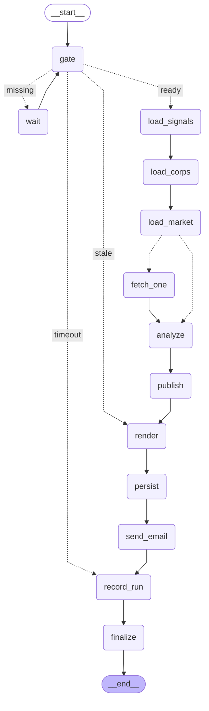

# GRAPH.md — 그래프 구조

> **이 파일은 `scripts/export_graph.py`가 생성한다. 직접 고치지 않는다.**
> 그래프를 바꿨으면 스크립트를 다시 돌려 커밋한다 (SPEC N12).
>
> 설계 의도와 각 노드가 하는 일은 `PLAN.md` §1-1, 설계도는 `graph.png`를 본다.
> `fetch_one`은 종목마다 `Send()`로 띄우는 fan-out 노드다 — 그림에는 하나로 보인다.

