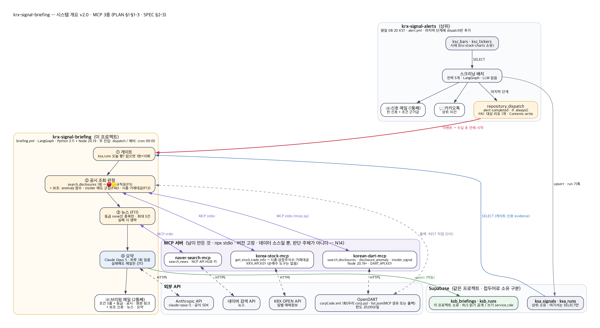
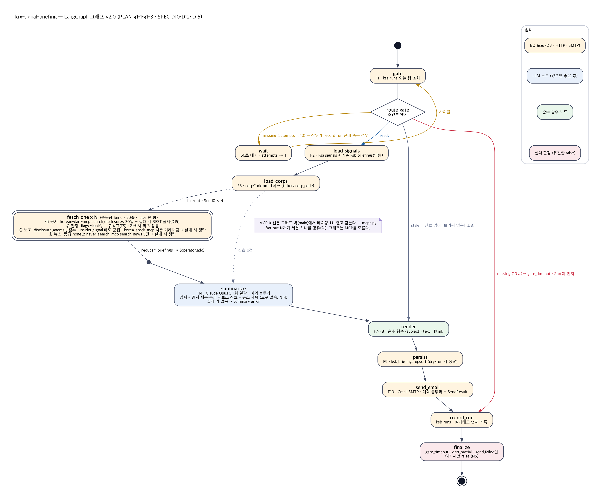
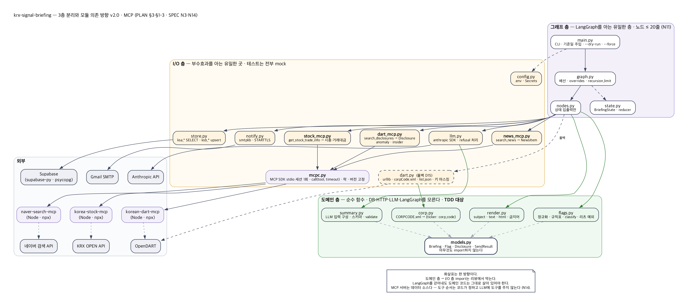

# PLAN.md — krx-signal-briefing

> **상태: 확정 v1.0** (2026-08-26). SPEC v1.1(D1~D11 확정 · D3 = `repository_dispatch`)을 입력으로 작성. 사용자가 TASKS.md 작성을 지시해 확정으로 본다.
> 구조는 `../krx-signal-alerts/docs/PLAN.md`를 따른다 — 같은 3층 분리, 같은 그래프 규칙. 오가기 쉬워야 한다.

---

## 1. 아키텍처



```
krx-signal-alerts (상위)                          krx-signal-briefing (이 프로젝트)
──────────────────────────────                   ─────────────────────────────────────────
08:20  alert.yml                                 briefing.yml
  스크리닝 → ksa_signals ── SELECT ───────────▶    게이트(ksa_runs) → 신호 읽기 → DART → 판정
           → ksa_runs                                     → Claude 요약 → 메일 → ksb_briefings
           → 신호 메일                                                          → ksb_runs
  [마지막 단계] repository_dispatch ──────────▶   ▲ 주 진입: alert-completed 이벤트 (수십 초 뒤)
                                                  ▲ 예비 진입: cron 09:05 (이미 돌았으면 no-op)
```

상위에 손대는 곳은 **`alert.yml` 마지막 단계 하나**뿐이다 (SPEC F0). 스크리닝·발송 로직·테이블은 그대로다.

세 층. **그래프 층만 LangGraph를 알고, 도메인 층은 아무것도 모른다** (SPEC N3).

| 층 | 모듈 | 규칙 |
|----|------|------|
| 그래프 | `state.py` · `nodes.py` · `graph.py` | LangGraph를 아는 **유일한** 층. 노드 ≤ 20줄 (N11) |
| 도메인 | `corp.py` · `flags.py` · `render.py` · `summary.py` · `models.py` | 순수 함수. DB·HTTP·LLM·LangGraph를 import하지 않는다. **TDD 대상** |
| I/O | `dart.py` · `llm.py` · `store.py` · `notify.py` · `config.py` · `main.py` | 부수효과를 아는 유일한 곳 |

### 1-1. LangGraph 그래프 (D10)



> 원본: `diagrams/graph.dot`. 구현 후 실제 그래프는 `docs/GRAPH.md`(자동 생성, N12)와 대조한다.

```
                         START
                           │
                    ┌──────▼──────┐
              ┌────▶│    gate     │  F1 — ksa_runs 오늘 행 조회
              │     └──────┬──────┘
              │            │
              │     ◇ route_gate ◇                조건부 엣지
              │   missing │ stale │ ready
              │  (<10회)  │       │
        ┌─────┴─────┐     │       │
        │   wait    │     │       │   60초 대기 후 gate로 돌아간다 (사이클)
        └───────────┘     │       │   10회 넘으면 route_gate가 record_run(gate_timeout)으로 보낸다 — 기록이 먼저
                          │  ┌────▼─────────┐
                          │  │ load_signals │  F2 — ksa_signals + 기존 ksb_briefings(멱등)
                          │  └────┬─────────┘
                          │  ┌────▼─────────┐
                          │  │ load_corps   │  F3 — corpCode.xml 1회 → {ticker: corp_code}
                          │  └────┬─────────┘
                          │       │  fan-out — 종목당 Send()  (N개 병렬)
                          │   ┌───┼───┬ … ┐
                          │   ▼   ▼   ▼   ▼
                          │  fetch_one × N        F4·F5·F6 — list.json 1회 → 판정 → Briefing
                          │   └───┴───┼ … ┘
                          │           │  reducer: briefings += (operator.add)
                          │  ┌────────▼─────┐
                          │  │  summarize   │  F14 — Claude 1회 일괄. 예외를 밖으로 내지 않는다
                          │  └────────┬─────┘
                          └───────────┤        stale은 신호 없이 여기로 합류 (D8)
                             ┌────────▼─────┐
                             │    render    │  F7·F8 — 순수 함수 호출
                             └────────┬─────┘
                             ┌────────▼─────┐
                             │   persist    │  F9 — ksb_briefings upsert (dry-run이면 건너뜀)
                             └────────┬─────┘
                             ┌────────▼─────┐
                             │  send_email  │  F10 — 예외를 밖으로 내지 않는다
                             └────────┬─────┘
                             ┌────────▼─────┐
                             │  record_run  │  ksb_runs — 실패해도 먼저 기록
                             └────────┬─────┘
                             ┌────────▼─────┐
                             │   finalize   │  gate_timeout · dart_partial · send_failed면 여기서만 raise
                             └────────┬─────┘
                                     END
```

**설계 의도**

| 지점 | 왜 |
|------|-----|
| `gate → wait → gate` 사이클 | dispatch로 깨어났어도 "신호가 저장됐다"는 DB만 말한다(F1). 상위가 `record_run` 전에 죽은 경우를 **그래프 위에 보이는 루프**로 기다렸다가 끊는다 — `attempts`를 상태에 세고 `route_gate`가 10회(1분 간격)에서 `gate_timeout`으로 보낸다 — **`finalize`가 아니라 `record_run`으로** (구현 시 조정, 2026-08-26): 실패해도 `ksb_runs`에 먼저 남아야 한다. `recursion_limit`을 40으로 올린다(기본 25로는 10회 루프 + 뒤 노드가 안 들어간다). 예비 cron 경로는 그래프에 들어오기 전에 `main.py --if-not-briefed`가 오늘 `ksb_runs`를 보고 no-op으로 끝낸다 — 그래프는 진입 경로를 모른다 |
| `stale`이 `render`로 합류 | D8 — 신호 없이도 `[브리핑 없음]` 메일을 보낸다. 침묵하지 않는다 |
| 종목별 `Send()` fan-out | 15건 DART 조회를 병렬로. **`briefings` reducer 필수** — 빠뜨리면 마지막 하나만 남고 예외도 안 난다(상위에서 실증). 노드 안에서 조회 실패는 `level='error'` Briefing으로 돌려보내고 **raise하지 않는다** — 한 종목 때문에 fan-out 전체가 죽으면 안 된다 |
| `fetch_one` 안에 판정(F5)까지 | 조회→판정은 종목 단위로 닫힌 일이다. 노드는 `dart.fetch()` 한 줄 + `flags.classify()` 한 줄 + Briefing 조립이라 20줄 안에 든다 |
| `summarize`가 예외를 내지 않음 | R11 — LLM은 있으면 좋은 층. 실패는 `summary_error`에 적고 `render`가 `⚠ 요약 생성 실패`를 붙인다. 키가 없으면(R12) 호출 자체를 건너뛰고 같은 경로 |
| `persist`가 `send_email` 앞 | 발송이 실패해도 브리핑은 남는다. 재실행하면 DART·LLM을 다시 부르지 않고 발송만 다시 한다(N6) |
| `record_run`이 `finalize` 앞 | 실패해도 `ksb_runs`에 먼저 남는다 |
| 체크포인터 없음 | 단발 배치. 상태에 API 키가 섞이지 않게도 한다 |

**노드별 재시도**: `gate` · `load_signals` · `load_corps`에 `RetryPolicy(3회, 지수 백오프)`. `fetch_one`·`summarize`·`send_email`은 예외를 내지 않으므로 노드 재시도가 걸리지 않는다 — 전송 재시도는 각 클라이언트(`dart.py` 1회, SDK 기본 2회, `notify.py` 1회) 안에서.

### 1-2. 상태 정의

```python
# briefing/state.py
class BriefingState(TypedDict, total=False):
    # main이 주입 — 노드는 "오늘"을 모른다
    run_date: date
    dry_run: bool
    force: bool                      # 기존 브리핑·요약이 있어도 다시 만든다

    # gate
    gate: Literal["ready", "stale", "missing"]
    attempts: int
    data_date: date | None

    # 입력
    signals: list[SignalRow]         # ksa_signals 행 (evidence 포함)
    existing: dict[str, Briefing]    # 그날 이미 있는 ksb_briefings — 멱등 판단
    corp_codes: dict[str, str]       # ticker → corp_code

    # fan-out 합류 — reducer 필수
    briefings: Annotated[list[Briefing], operator.add]
    dart_calls: Annotated[int, operator.add]

    # 요약
    summaries: dict[str, str]        # ticker → summary
    summary_error: str
    llm_tokens: int

    # 출력
    subject: str
    text: str
    html: str
    send: SendResult | None
    status: str                      # ksb_runs.status 값
```

`Send("fetch_one", {...})`로 넘기는 개별 상태는 `{"signal": SignalRow, "corp_code": str | None, "existing": Briefing | None, "force": bool}` — fan-out 노드는 전체 상태를 받지 않는다.

---

### 1-3. v2.0 — MCP 계층 (SPEC §2-3, 확정 대기)

```
fetch_one (종목당 Send)                              ← 구조는 그대로, 안에서 부르는 것이 바뀐다
  ① 공시   dart_mcp.search_disclosures(corp_code, 30)   실패 → dart.fetch_disclosures() REST 폴백 (D15)
  ② 판정   flags.classify()                              변경 없음 — 규칙표가 등급을 정한다
  ③ 보조   dart_mcp.anomaly() · dart_mcp.insider()       실패 → 생략 (있으면 좋은 층)
           stock_mcp.trade_info(ticker)                   시총·상장주식수·5일 거래대금 (D14) · 실패 → 생략
  ④ 뉴스   news_mcp.search_news(name, 5)                 등급 none일 때만 · 실패 → 생략
```

- **MCP 세션은 배치당 1회** 연다 — `mcpc.py`가 `npx -y <pkg>@<ver>`를 stdio로 띄우고 `ClientSession`을 들고 있다가 `main`이 끝날 때 닫는다. 종목 15개가 세션 하나를 공유한다(`Send` fan-out은 스레드 병렬이므로 세션 호출에 락).
- **도구 호출 순서는 코드가 정한다** (D12·N14). LLM에는 도구를 주지 않는다.
- I/O 층에 `mcpc.py`(세션·타임아웃·버전 고정) · `dart_mcp.py`(응답 → `Disclosure`/anomaly/insider) · `news_mcp.py`(응답 → `NewsItem`) · `stock_mcp.py`(응답 → 시총·거래대금)가 늘고, `dart.py`는 폴백으로 남는다. 도메인 층은 `flags.py`에 규칙 `insider_sell_cluster` 하나가 는다.
- 테스트: MCP 응답은 **표본 JSON**(`tests/fixtures/mcp_*.json`)으로 mock — 실제 Node 기동은 CI 통합 단계에서만.

## 2. 디렉토리 구조

```
krx-signal-briefing/
├── briefing/
│   ├── __init__.py
│   ├── config.py          # .env 로딩 · require/optional (상위와 동일 방식, dotenv 없음)
│   ├── models.py          # SignalRow · Disclosure · Flag · Briefing · SendResult · RunRecord
│   ├── state.py           # BriefingState
│   ├── nodes.py           # 노드 — 얇다
│   ├── graph.py           # 배선 · overrides(테스트용) · recursion_limit
│   ├── corp.py            # [순수] CORPCODE.xml 바이트 → {stock_code: corp_code}
│   ├── flags.py           # [순수] report_nm 정규화 · 규칙표 · classify() · 리츠 예외
│   ├── render.py          # [순수] subject · text · html · 금지어 상수
│   ├── summary.py         # [순수] LLM 입력 구성 · JSON 스키마 · 응답 검증(N13)
│   ├── dart.py            # [I/O] corpCode.xml · list.json — urllib · 키 마스킹 · 013/020 처리
│   ├── llm.py             # [I/O] anthropic SDK 호출 — 모델 · 구조화 출력 · refusal 처리
│   ├── store.py           # [I/O] ksa_* 읽기 · ksb_* 쓰기 (supabase-py + psycopg)
│   ├── notify.py          # [I/O] Gmail SMTP (상위 notify/email.py와 같은 방식)
│   └── main.py            # CLI — --date · --dry-run · --force · --if-not-briefed(예비 cron용)
├── supabase/schema.sql    # ksb_briefings · ksb_runs · RLS (멱등)
├── scripts/
│   ├── apply_schema.py
│   ├── export_graph.py    # → docs/GRAPH.md (N12)
│   ├── dryrun.py          # 과거 N거래일 신호에 DART 판정만 (발송·저장·LLM 없음) → 등급 분포
│   └── sample_reports.py  # M1 — 실제 report_nm 표본 수집 → tests/fixtures/
├── tests/
│   ├── conftest.py        # wiring() — I/O 노드를 항상 스텁으로
│   ├── fixtures/          # corpcode_sample.xml · list_*.json · report_names.txt
│   ├── test_corp.py · test_flags.py · test_render.py · test_summary.py
│   ├── test_dart.py       # urlopen mock — 013/020/타임아웃
│   ├── test_llm.py        # SDK mock — 성공/실패/refusal/키 없음
│   ├── test_store.py · test_notify.py
│   └── test_graph.py      # 배선만 — 게이트 3경로 · 루프 상한 · reducer 합류 · 실패 시 record_run 도달
├── .github/workflows/
│   ├── briefing.yml       # repository_dispatch(alert-completed) · cron 05 00 * * 0-4 예비 · workflow_dispatch
│   └── ci.yml             # ruff · mypy · pytest
├── docs/ SPEC.md · PLAN.md · TASKS.md · GRAPH.md · *.png · diagrams/*.dot
├── requirements.txt       # langgraph · anthropic · supabase · psycopg[binary] · certifi
├── requirements-dev.txt   # ruff · mypy · pytest
├── .env.example · .gitignore · CLAUDE.md · README.md · README_KO.md
```

`pandas`·`requests`·`langchain-*`는 없다 (N4).

---

## 3. 모듈 의존 관계



```
main ──▶ graph ──▶ nodes ──┬──▶ store ──▶ (supabase, psycopg)
                           ├──▶ dart  ──▶ (urllib)          ──▶ corp   [순수]
                           ├──▶ llm   ──▶ (anthropic)       ──▶ summary[순수]
                           ├──▶ notify──▶ (smtplib)
                           ├──▶ flags  [순수]
                           └──▶ render [순수]
                                            ▲
models ◀────────────────── 전부 ────────────┘     models는 아무것도 import하지 않는다
```

- 화살표는 **한 방향**이다. 순수 모듈이 I/O 모듈을 import하면 리뷰에서 막는다.
- `nodes.py`가 20줄을 넘기 시작하면 도메인 모듈로 옮긴다 — 그래프가 아니라 함수를 테스트한다.

---

## 4. 공유 계약

### 4-1. 읽는 계약 — `ksa_signals.evidence` (상위 PLAN §4)

```jsonc
{ "conditions": [{"label": "...", "ok": true, "actual": "..."}],
  "price": {"close": 71200, "change_pct": 2.14},
  "meta": {"in_progress": false} }
```
`render.py`는 이 키를 그대로 렌더한다. **키가 없으면 그 줄을 비우고 계속 간다** (R8) — 메일 전체를 죽이지 않는다. M0에서 상위 PLAN §4에 "세 번째 소비자: krx-signal-briefing"을 등재 요청한다.

### 4-2. 쓰는 계약 — `Briefing` → `ksb_briefings`

```python
@dataclass(frozen=True, slots=True)
class Disclosure:  rcept_dt: date; report_nm: str; rcept_no: str; flr_nm: str; corrected: bool
@dataclass(frozen=True, slots=True)
class Flag:        rule: str; level: Literal["red", "amber"]; rcept_no: str; report_nm: str
@dataclass(frozen=True, slots=True)
class Briefing:
    d: date; strategy: str; ticker: str; name: str
    corp_code: str | None
    level: Literal["red", "amber", "none", "unknown", "error"]
    flags: tuple[Flag, ...]; disclosures: tuple[Disclosure, ...]
    window_days: int = 30
    summary: str | None = None
    error: str = ""                       # level == 'error'일 때 원인 (저장은 detail에)
    def link(self, rcept_no: str) -> str: ...   # dart.fss.or.kr/dsaf001/main.do?rcpNo=
```

### 4-3. LLM 계약 — `summary.py` (F14·N13)

- **입력** (코드가 만든다): `[{ticker, name, level, flags: [{report_nm, rcept_dt}], disclosures: [{rcept_dt, report_nm}]}]` — 공시 1건 이상인 종목만.
- **출력 스키마**: `{"items": [{"ticker": str, "summary": str}]}` — 구조화 출력으로 강제.
- **시스템 프롬프트 골자**: 사실만 · 입력에 있는 공시만 · 80자 이내 · 금지어 목록(N1) 명시 · 등급은 바꾸지 않는다 · 한국어.
- **검증** `validate(items, inputs) -> dict[str, str]`: 금지어 · 길이 · 입력에 있는 티커 · 빈 문자열 → 걸린 항목은 버린다(로그에 사유).
- **`llm.py`**: `claude-opus-5` · 적응형 사고(기본값이므로 `thinking` 생략) · `max_tokens=4096` · 타임아웃 60초 · SDK 기본 재시도 2회 · **`stop_reason == "refusal"`이면 요약 실패로 처리** · 서버측 fallback(`fallbacks: "default"`)은 M3에서 `claude-api` 스킬의 파이썬 README로 시그니처를 확인한 뒤 결정. 호출부는 함수 하나 — 테스트는 이 함수를 mock한다.

---

## 5. 마일스톤

각 마일스톤은 **ruff · mypy strict · pytest 통과 + 완료 기준 충족**으로 닫는다. 화면이 없으므로 DESIGN.md는 없다.

### M0 — 뼈대 + 걷는 해골 (1일)

- 디렉토리·venv·`requirements*.txt`·`.env.example`·`.gitignore`·`CLAUDE.md`(프로젝트 규칙)
- `schema.sql` + `apply_schema.py` → 실DB에 `ksb_*` 생성, RLS 확인(anon 쓰기 차단)
- `models.py` · `state.py` · `graph.py` 배선 — **모든 노드가 스텁**인 채로 START→END 완주
- `config.py` · `store.py`의 게이트 조회(`gate`)만 실구현 → `python -m briefing.main --dry-run`이 오늘 `ksa_runs`를 읽고 "ready/missing"을 찍는다
- `export_graph.py` → `docs/GRAPH.md`
- `ci.yml` (ruff·mypy·pytest) · 깃허브 리포 생성(public) · 첫 푸시
- 상위 PLAN §4에 소비자 등재 요청(상위 문서 한 줄 — 사용자 확인 후)

**완료 기준**: 그래프 배선 테스트(게이트 3경로·루프 상한) 통과 · 실DB에서 게이트가 오늘 행을 읽는다 · `ksb_*` RLS 검증 · CI 녹색

### M1 — DART 계층 ★ TDD 핵심 (1.5일)

- `corp.py` — 표본 XML로 파서 TDD (`stock_code` 공백 처리 · 중복 · 인코딩)
- `dart.py` — `urlopen` mock: `000`/`013`/`020`/5xx/타임아웃 · **키 마스킹** 테스트
- `sample_reports.py` — 최근 60거래일 신호 종목의 실제 `report_nm`을 뽑아 `fixtures/report_names.txt`로 (이게 규칙표의 근거)
- `flags.py` — 정규화(공백·`ㆍ`·괄호·`[정정]`) · 규칙표 · 리츠 예외(D9) TDD. **규칙 하나당 양성 1 + 음성 1** — 키워드 하나를 지워도 테스트가 통과하면 그 규칙은 검증되지 않은 것
- `fetch_one` 노드 + `Send` fan-out + reducer 합류 테스트
- `dryrun.py` — 60거래일 등급 분포 · `unknown` 비율 · 하루 호출 수 → **SPEC F5 규칙표 확정**(변경 시 일자·근거 기록)

**완료 기준**: 규칙표가 실데이터 표본과 대조됨 · 드라이런 분포 합리적 · 🔴 표본 전 건 원문 링크로 손검증 · 일 호출 < 100회

### M1b — MCP 계층 (1.5일, v2.0 · D12~D15 확정 후)

- `mcpc.py` — `mcp` SDK stdio 클라이언트: 서버 정의(패키지@버전 · env) · 세션 1회 · `call(tool, args, timeout=30)` · 락 · 실패 예외
- `dart_mcp.py` — `search_disclosures` 응답 → `Disclosure` · `disclosure_anomaly` → `{score, verdict}` · `insider_signal` → 군집 종류. 표본 JSON 계약 테스트
- `flags.py` — 🟡 `insider_sell_cluster` 규칙 + SAMPLES
- `fetch_one` 재구성 — ①~③ + REST 폴백 + 생략 표기 (20줄 유지 — 순서는 `dart_mcp.enrich()`로 묶는다)
- `schema.sql` — `ksb_briefings.anomaly jsonb` (`alter table … add column if not exists`)
- CI — `setup-node`(20.19) + npm·`~/.korean-dart-mcp` 캐시 · 기동 시간 측정 → 「측정 기록」
- 드라이런에 MCP 경로 추가 — REST 결과와 **공시 목록이 같은지** 대조(회귀)

**완료 기준**: MCP 경로와 REST 경로의 30일 공시 목록이 일치 · korean-dart-mcp를 죽여도 폴백으로 완주 · CI 기동 < 60초

### M1c — 뉴스 (1일, v2.0)

- `news_mcp.py` — `search_news(query, display=5, sort="date")` → `NewsItem(title, press, date, link)` · HTML 태그·엔티티 제거 · 표본 계약 테스트
- `fetch_one` ④ — 등급 `none`만 · 실패 시 생략
- `render` — 📰 블록(제목·언론사·날짜·링크) · `⚠ 뉴스 생략` · 금지어 검사에 뉴스 제목은 **원문 예외**
- `summary` — 입력에 뉴스 제목 포함, "입력에 없는 사실 금지" 유지

**완료 기준**: `none` 종목에 뉴스가 붙은 메일 1통 손검증 · 키 없이 돌려도 메일 도착

### M2 — 본문·저장·발송 (1일)

- `render.py` TDD — 🔴 요약 블록 · 전략/종목 순서 = 상위와 동일 · 링크 필수(N2) · 금지어(N1) · HTML 이스케이프 · 0건/데이터 지연/조회 실패 제목(F8) · 요약 실패 경고 줄
- `store.py` — `ksb_briefings` upsert(멱등) · 기존 브리핑 읽기 · `ksb_runs` insert
- `notify.py` — SMTP mock · 평문+HTML
- `persist` · `send_email` · `record_run` · `finalize` 노드 — 발송 실패 시 `record_run` 도달 배선 테스트
- 실DB + 실발송 1회 (`--date`로 어제 신호) — **요약 없이** 두 번째 메일 도착 확인

**완료 기준**: 요약 없는 브리핑 메일이 실제로 도착 · 재실행 시 DART 재호출 없음(N6) · 받은편지함 확인

### M3 — Claude 요약 (1일)

- `summary.py` TDD — 입력 구성(공시 0건 종목 제외) · 스키마 · `validate()`(금지어·길이·티커·빈 값)
- `llm.py` — SDK mock: 성공 · API 오류 · 타임아웃 · `refusal` · **키 없음(R12)** → 전부 `summary_error`로
- `summarize` 노드 — 예외 불투과 · 기존 `summary` 있으면 건너뜀(`--force` 제외)
- `ksb_runs.summary_n` · `llm_tokens` 기록
- 실호출 1회 → 요약 문구·토큰·비용 기록. 원문과 대조해 **입력에 없는 사실 0건** 확인

**완료 기준**: 키를 빼고 돌려도 `⚠ 요약 생성 실패` 메일 도착 · 실요약 5종목 손검증 · 비용 기록

### M4 — 자동화·배포 (1일 + 관찰 5거래일)

- `briefing.yml` — 진입 3종(`repository_dispatch: [alert-completed]` · 예비 cron `05 00 * * 0-4` · `workflow_dispatch(date, dry_run, force)`) · `timeout-minutes: 25` · `permissions: contents: read` · `concurrency: briefing`. 예비 cron 경로는 `--if-not-briefed`
- `main.py --if-not-briefed` — 오늘 `ksb_runs` 있으면 로그 한 줄 + 종료 0 (테스트 포함)
- **상위 리포 작업 (`krx-signal-alerts`)** — 사용자 확인 후 커밋: ① fine-grained PAT 생성(대상 `krx-signal-briefing` 1개 · `Contents: write`) → 상위 Secrets `BRIEFING_DISPATCH_TOKEN` ② `alert.yml` 끝에 dispatch 단계(SPEC F0, `if: always()`) ③ 상위 CLAUDE.md·TASKS.md에 한 줄(단계 존재·PAT 만료일)
- 이 리포 Secrets 8종: `DART_API_KEY` · `ANTHROPIC_API_KEY` · `SUPABASE_URL` · `SUPABASE_SERVICE_KEY` · `SUPABASE_DATABASE_URL` · `GMAIL_ADDRESS` · `GMAIL_APP_PASSWORD` · `RECIPIENTS`
- **배포 전 보안 점검**(N9): 보안 리뷰 · 히스토리 시크릿 스캔(키 포맷 `sk-ant-`·`github_pat_`·DART 40자 포함) · 로그 마스킹 · 워크플로 권한 · PAT 범위 확인 · `ksb_*` RLS
- **트리거 3경로 시험** (SPEC §9-5): ① 상위 `workflow_dispatch` 수동 실행 → 이 워크플로가 1분 안에 시작 ② 이미 브리핑된 날 예비 cron → no-op ③ 상위 배치 없는 날 수동 실행 → 10분 뒤 `gate_timeout` 실패
- **연속 5거래일 관찰** — 두 메일 순서·요약 품질·`ksb_runs` 상태

**완료 기준**: SPEC §9 1~8 전부

### M5 — 마무리 (0.5일)

- README.md / README_KO.md (상호 링크) · 워크스페이스 CLAUDE.md 표 갱신 · 메모리 갱신
- 미해소 이슈·측정 기록을 TASKS.md에 정리

---

## 6. 테스트 전략

| 대상 | 방식 | 왜 |
|------|------|-----|
| `corp` | 표본 XML(정상·`stock_code` 공백·중복 corp) | 상장사 3천 개 중 하나라도 빠지면 `unknown`으로 새는데 조용하다 |
| `flags` | **규칙당 양성 1 + 음성 1** · 정규화 변형(`유상증자 결정`·`[정정]유상증자결정`·`ㆍ`) · 리츠 예외 · 등급 최댓값 | 키워드 하나를 지워도 통과하면 검증 안 된 것 |
| `render` | 금지어 · 링크 필수 · 이스케이프 · 제목 4종 · 순서 동일성 · 요약 실패 줄 | 문구 경계(R7)가 여기서 지켜진다 |
| `summary` | `validate()` — 금지어·길이·미지 티커·빈 값 · 입력 구성에서 공시 0건 제외 | LLM 없이 LLM 출력 규칙을 테스트한다 |
| `dart` | `urlopen` mock — 013/020/5xx/타임아웃 · **로그에 키가 없다** | N7 |
| `llm` | SDK 클라이언트 mock — 성공/오류/refusal/키 없음 | 테스트가 실제로 과금하면 안 된다 |
| `store` · `notify` | 클라이언트 mock | 실DB·실발송 금지 |
| **`graph`** | **배선만** — `wiring()`이 I/O 노드를 항상 스텁으로 덮는다. ① 게이트 ready/stale/missing 3경로 ② missing 10회 후 `finalize(gate_timeout)` ③ **reducer가 N개 Briefing을 합치는지** ④ `summarize`·`send_email` 실패 시 `record_run` 도달 | 도메인 로직을 그래프로 테스트하지 않는다 (N11) |
| 통합 | `dryrun.py` — 실DB·실DART, 발송·저장·LLM 없음 | 실데이터에서만 보이는 `report_nm` 변형 |

**금지**: 실DB에 붙는 단위 테스트 · 실제로 보내는 테스트 · 실제로 과금하는 테스트 · 그래프를 통한 도메인 테스트.

---

## 7. 리스크와 대응 (SPEC §6 중 실행 관점)

| 리스크 | 대응 |
|--------|------|
| DART가 15건 **동시 요청**을 막을 수 있다 (미확인) | M1 드라이런에서 `020`이 보이면 `fetch_one`을 `max_concurrency`로 제한하거나 순차 루프로 바꾼다. 그래프 구조는 유지 |
| `report_nm` 표기 변형으로 규칙 미탐 | M1 `sample_reports.py` 표본이 근거. 애매하면 🟡 (R4) |
| 게이트 루프가 `recursion_limit`에 걸린다 | 40으로 설정 + 배선 테스트 ②가 10회 경로를 통과하는지 확인 |
| **dispatch PAT 만료·누락** (R13) | 상위 마지막 단계가 실패해 알려 준다 + 예비 cron 09:05가 그날 브리핑을 대신 돌린다. 만료일은 TASKS 미해소 이슈에 기록 |
| dispatch와 예비 cron이 같은 날 둘 다 돈다 | `concurrency: briefing` 직렬화 + `--if-not-briefed` + F9 멱등 — 두 번째는 no-op이거나 DART·LLM 재호출 없이 끝난다 |
| 상위 `alert.yml` 수정이 상위 배치를 깨뜨린다 | 단계를 **맨 끝**에 `if: always()`로 둔다 — 앞 단계 결과에 영향 없음. 상위 리포에서 `workflow_dispatch --dry-run`으로 먼저 검증 |
| `Send` fan-out에서 reducer 누락 | 배선 테스트 ③ — 지우지 말 것 |
| LLM 응답이 스키마를 어긴다 | 구조화 출력 + `validate()`. 파싱 실패도 `summary_error` |
| Opus 5 `refusal` | 요약 실패로 처리. 공시 제목 요약이 거부될 가능성은 낮지만 코드 경로는 둔다 |
| 상위 `evidence` 키 변경 | 키 누락 시 줄만 비운다(R8). 상위 PLAN §4 등재로 변경 시 알림 |
| 비용 폭주 | 하루 1회 · `llm_tokens` 기록 · 일괄 호출 외 어떤 루프도 없다 |

---

## 8. 일정

| 마일스톤 | 소요 | 누적 |
|----------|------|------|
| M0 뼈대 | 1일 | 1일 |
| M1 DART | 1.5일 | 2.5일 |
| M2 본문·발송 | 1일 | 3.5일 |
| M3 요약 | 1일 | 4.5일 |
| M4 자동화 | 1일 + 관찰 5거래일 | 5.5일 + 1주 |
| M5 마무리 | 0.5일 | 6일 + 1주 |

---

## 9. 사용자 준비물

| 시점 | 항목 |
|------|------|
| **M0 전** | **OpenDART 인증키** (opendart.fss.or.kr 회원가입 → 인증키 신청, 무료·즉시) |
| M0 전 | 깃허브 리포 `krx-signal-briefing` 생성 (public) |
| M0 | 상위 PLAN §4 소비자 등재 한 줄 — 확인만 |
| **M3 전** | **Anthropic API 키** (console.anthropic.com) — 없으면 M3를 "키 없음 경로"까지만 닫고 관찰 중 붙인다 |
| **M4** | **fine-grained PAT 생성** — Resource owner 본인 · Repository access: `krx-signal-briefing`만 · Permissions: Contents **Read and write** · 만료 1년 → 상위 리포 Secrets `BRIEFING_DISPATCH_TOKEN` |
| M4 | 상위 `alert.yml` 수정 커밋 확인 · 이 리포 Secrets 8종 등록 · 첫 주 스팸함 확인 |

---

## 10. 변경 이력

| 일자 | 버전 | 내용 |
|------|------|------|
| 2026-08-26 | v0.9 | 최초 작성. SPEC v1.0 기준. 그래프(게이트 루프 · 종목별 Send fan-out · summarize 격리), 3층 분리, M0~M5 |
| 2026-08-26 | v0.9.1 | 아키텍처 그림 3장 PNG 추가 (`arch-overview.png` · `graph.png` · `modules.png`, 원본 `diagrams/*.dot`) — 사용자 요청 |
| 2026-08-26 | v0.9.2 | **SPEC v1.1(D3 `repository_dispatch`) 반영** — §1 개요·그림, 게이트 루프 1분×10, `--if-not-briefed`, M4에 상위 `alert.yml`·PAT 작업, §7 리스크 3건, §9 준비물 |
| 2026-08-26 | **v1.0 확정** | 사용자 TASKS.md 작성 지시로 확정. 태스크 55개(M0 12 · M1 10 · M2 9 · M3 8 · M4 11 · M5 5) |
| 2026-08-29 | v1.1 검토 | 그림 3장 v2.0으로 갱신 — `arch-overview.png`(MCP 서버 층 · REST 폴백 · korea-stock-mcp 회색) · `graph.png`(`fetch_one` ①~④ · MCP 세션 메모) · `modules.png`(`mcpc`·`dart_mcp`·`news_mcp` · `dart.py` 폴백). 원본 `diagrams/*.dot` |
| 2026-08-29 | v1.1 검토 | **v2.0 MCP 전환** 반영 — §1-3 MCP 계층, M1b·M1c 마일스톤 신설 (SPEC §2-3 D12~D15 확정 대기) |
| 2026-08-29 | v1.0.2 | `FetchItem`에 `run_date` 추가 — 조회 창은 `[run_date−30, run_date]` (SPEC F4 `end_de=D`, D = 실행일). 드라이런은 `d+1`을 실행일로 본다 |
| 2026-08-26 | v1.0.1 | 구현 중 조정 — `gate_timeout` 경로가 `finalize` 직행이 아니라 **`record_run`을 거친다** (실패 기록 우선 원칙). fan-out 0건이면 조건부 엣지가 `summarize`로 직행(빈 Send 목록은 그래프를 조용히 끝낸다) |
